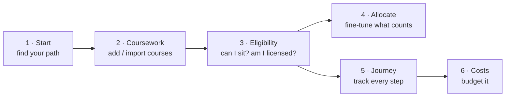
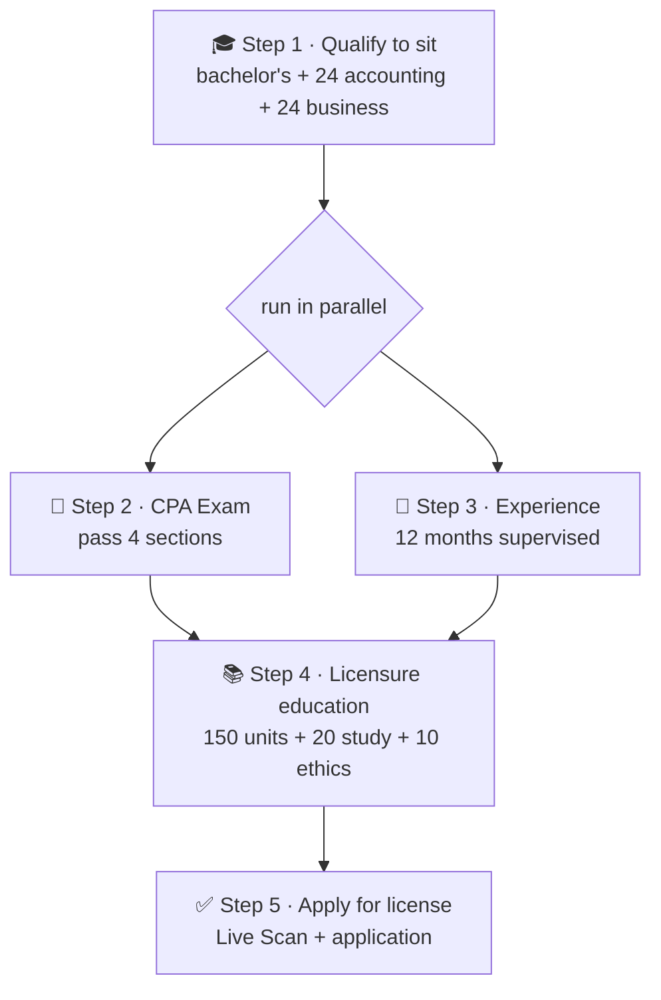

# 📖 PathToCPA — User Guide

A friendly walkthrough for planning your **California CPA** licensure with PathToCPA.
No account or setup needed — open the app and start.

> ⚠️ **Planning aid, not official advice.** California only. Always confirm with the
> [California Board of Accountancy (CBA)](https://www.dca.ca.gov/cba/).

There's also an in-app version of this at **`/faq`** (Footer → "FAQ & how to use").

---

## 🚀 The big picture

Work left-to-right. Most people start at **Start**, add their **Coursework**, then check
**Eligibility**. The other pages help you refine and track.

---

## Step by step

### 1 · Start — find your path  (`/start`)
Answer three questions (highest degree, master's field, undergrad major) and click
**Apply to my profile**. You'll get a recommended route and a comparison of every option,
plus the **three California licensure pathways** (incl. the new 120-unit route arriving in 2027).

### 2 · Coursework — add your classes  (`/coursework`)
Two ways to add courses:
- **Type them in** with the *Add a course* form, or
- **Import a spreadsheet** — click *CSV template* or *Excel template*, fill one row per
  course (or have an AI chatbot fill it from your transcript), then *Choose file…*. You get an
  editable, validated preview before importing.

We tally your units by category automatically. Edit any cell in the table directly; imported
rows are **locked** (🔒) until you click to unlock. Once you have courses, an
**"Allocate courses →"** button appears.

### 3 · Eligibility — where you stand  (`/eligibility`)
See two verdicts:
- **Can you sit for the exam?** — needs a bachelor's + 24 accounting + 24 business units.
- **Are you licensed?** — needs 150 total units + 24/24 + 20 accounting-study + 10 ethics-study.

Click **See full breakdown** for a category-by-category "size chart" of what counts, what
you've used, and what's left.

### 4 · Allocate — fine-tune what counts  (`/allocate`)
Drag each course into the exact requirement and sub-area it should count toward when the
automatic guess isn't perfect. Click courses to multi-select, then drag any one to move them
together. Anything left in the **Unused pool** still counts toward your 150-unit total.

### 5 · Journey — track every step  (`/journey`)
The **real California flow**:

Check off exam sections (drag to set your planned order), log experience months, and enter
your **exam deadline dates** to track the three time windows: the **90-day** payment window,
the **9-month** NTS window, and the **30-month** conditional-credit window. The
**Step-by-step guides** (📚) live here too.

> Note: California removed the **PETH ethics exam** on July 1, 2024 — it's no longer required.

### 6 · Costs — budget it  (`/costs`)
Start from the **California template**, edit every line to match your plan, and mark items
**planned vs paid** as you go. See spending by category and **export to CSV**.

---

## 💾 Your data & what could cause data loss

PathToCPA never requires an account. Where your data lives depends on your choice:

| Mode | Where data is stored | Survives… | Could be **lost** if… |
|------|----------------------|-----------|------------------------|
| **Anonymous** (not signed in) | This browser only | Closing/restarting the browser | You clear browsing data, use another browser/device, use incognito, or the browser evicts storage |
| **Signed in · "This device"** | This browser only (per account) | Closing/restarting the browser | Same as above, **plus** signing out clears it (we warn you first) |
| **Signed in · "Cloud"** | The database (Supabase) | Clearing the browser, switching devices | Only if you click **Clear data** or delete your account |

**➡️ To never lose your data, sign in and choose "Cloud."** It then follows you across
devices and survives clearing your browser.

When you **sign out**, this browser's copy is cleared — cloud data comes back on your next
sign-in, but **local-only** data is removed (the app warns you before this).

---

## ❓ More help

- In-app **FAQ & how to use**: `/faq`
- **Step-by-step CBA guides** (transcripts, exam application, Live Scan, licensing): `/guides`
- Official source: [California Board of Accountancy](https://www.dca.ca.gov/cba/)
